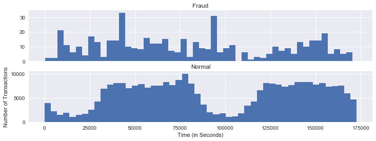
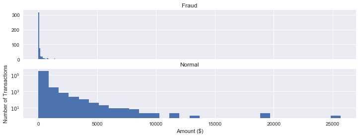
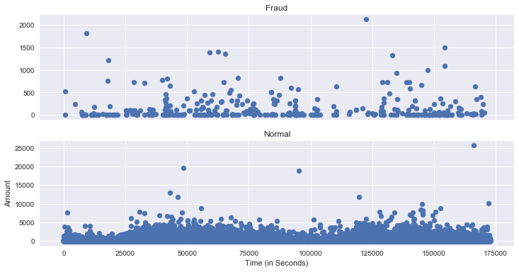
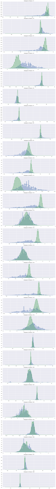
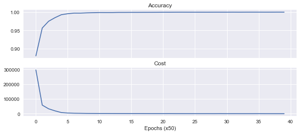

```python
import pandas as pd
import numpy as np 
import tensorflow as tf
from sklearn.cross_validation import train_test_split
import matplotlib.pyplot as plt
from sklearn.utils import shuffle
from sklearn.metrics import confusion_matrix
import seaborn as sns
import matplotlib.gridspec as gridspec
from sklearn.preprocessing import StandardScaler
from sklearn.manifold import TSNE
```

    /Users/ccuulinay/.pyenv/versions/anaconda3-4.2.0/envs/dlnd/lib/python3.6/site-packages/sklearn/cross_validation.py:44: DeprecationWarning: This module was deprecated in version 0.18 in favor of the model_selection module into which all the refactored classes and functions are moved. Also note that the interface of the new CV iterators are different from that of this module. This module will be removed in 0.20.
      "This module will be removed in 0.20.", DeprecationWarning)


```python
df = pd.read_csv("data/creditcard.csv")
```


```python
df.head()
```


<div>
<table border="1" class="dataframe">
  <thead>
    <tr style="text-align: right;">
      <th></th>
      <th>Time</th>
      <th>V1</th>
      <th>V2</th>
      <th>V3</th>
      <th>V4</th>
      <th>V5</th>
      <th>V6</th>
      <th>V7</th>
      <th>V8</th>
      <th>V9</th>
      <th>...</th>
      <th>V21</th>
      <th>V22</th>
      <th>V23</th>
      <th>V24</th>
      <th>V25</th>
      <th>V26</th>
      <th>V27</th>
      <th>V28</th>
      <th>Amount</th>
      <th>Class</th>
    </tr>
  </thead>
  <tbody>
    <tr>
      <th>0</th>
      <td>0.0</td>
      <td>-1.359807</td>
      <td>-0.072781</td>
      <td>2.536347</td>
      <td>1.378155</td>
      <td>-0.338321</td>
      <td>0.462388</td>
      <td>0.239599</td>
      <td>0.098698</td>
      <td>0.363787</td>
      <td>...</td>
      <td>-0.018307</td>
      <td>0.277838</td>
      <td>-0.110474</td>
      <td>0.066928</td>
      <td>0.128539</td>
      <td>-0.189115</td>
      <td>0.133558</td>
      <td>-0.021053</td>
      <td>149.62</td>
      <td>0</td>
    </tr>
    <tr>
      <th>1</th>
      <td>0.0</td>
      <td>1.191857</td>
      <td>0.266151</td>
      <td>0.166480</td>
      <td>0.448154</td>
      <td>0.060018</td>
      <td>-0.082361</td>
      <td>-0.078803</td>
      <td>0.085102</td>
      <td>-0.255425</td>
      <td>...</td>
      <td>-0.225775</td>
      <td>-0.638672</td>
      <td>0.101288</td>
      <td>-0.339846</td>
      <td>0.167170</td>
      <td>0.125895</td>
      <td>-0.008983</td>
      <td>0.014724</td>
      <td>2.69</td>
      <td>0</td>
    </tr>
    <tr>
      <th>2</th>
      <td>1.0</td>
      <td>-1.358354</td>
      <td>-1.340163</td>
      <td>1.773209</td>
      <td>0.379780</td>
      <td>-0.503198</td>
      <td>1.800499</td>
      <td>0.791461</td>
      <td>0.247676</td>
      <td>-1.514654</td>
      <td>...</td>
      <td>0.247998</td>
      <td>0.771679</td>
      <td>0.909412</td>
      <td>-0.689281</td>
      <td>-0.327642</td>
      <td>-0.139097</td>
      <td>-0.055353</td>
      <td>-0.059752</td>
      <td>378.66</td>
      <td>0</td>
    </tr>
    <tr>
      <th>3</th>
      <td>1.0</td>
      <td>-0.966272</td>
      <td>-0.185226</td>
      <td>1.792993</td>
      <td>-0.863291</td>
      <td>-0.010309</td>
      <td>1.247203</td>
      <td>0.237609</td>
      <td>0.377436</td>
      <td>-1.387024</td>
      <td>...</td>
      <td>-0.108300</td>
      <td>0.005274</td>
      <td>-0.190321</td>
      <td>-1.175575</td>
      <td>0.647376</td>
      <td>-0.221929</td>
      <td>0.062723</td>
      <td>0.061458</td>
      <td>123.50</td>
      <td>0</td>
    </tr>
    <tr>
      <th>4</th>
      <td>2.0</td>
      <td>-1.158233</td>
      <td>0.877737</td>
      <td>1.548718</td>
      <td>0.403034</td>
      <td>-0.407193</td>
      <td>0.095921</td>
      <td>0.592941</td>
      <td>-0.270533</td>
      <td>0.817739</td>
      <td>...</td>
      <td>-0.009431</td>
      <td>0.798278</td>
      <td>-0.137458</td>
      <td>0.141267</td>
      <td>-0.206010</td>
      <td>0.502292</td>
      <td>0.219422</td>
      <td>0.215153</td>
      <td>69.99</td>
      <td>0</td>
    </tr>
  </tbody>
</table>
<p>5 rows × 31 columns</p>
</div>


```python
df.isnull().sum()
```


    Time      0
    V1        0
    V2        0
    V3        0
    V4        0
    V5        0
    V6        0
    V7        0
    V8        0
    V9        0
    V10       0
    V11       0
    V12       0
    V13       0
    V14       0
    V15       0
    V16       0
    V17       0
    V18       0
    V19       0
    V20       0
    V21       0
    V22       0
    V23       0
    V24       0
    V25       0
    V26       0
    V27       0
    V28       0
    Amount    0
    Class     0
    dtype: int64


```python
print ("Fraud")
print (df.Time[df.Class == 1].describe())
print ()
print ("Normal")
print (df.Time[df.Class == 0].describe())
```

    Fraud
    count       492.000000
    mean      80746.806911
    std       47835.365138
    min         406.000000
    25%       41241.500000
    50%       75568.500000
    75%      128483.000000
    max      170348.000000
    Name: Time, dtype: float64
    
    Normal
    count    284315.000000
    mean      94838.202258
    std       47484.015786
    min           0.000000
    25%       54230.000000
    50%       84711.000000
    75%      139333.000000
    max      172792.000000
    Name: Time, dtype: float64


```python
f, (ax1, ax2) = plt.subplots(2, 1, sharex=True, figsize=(12,4))

bins = 50

ax1.hist(df.Time[df.Class == 1], bins = bins)
ax1.set_title('Fraud')

ax2.hist(df.Time[df.Class == 0], bins = bins)
ax2.set_title('Normal')

plt.xlabel('Time (in Seconds)')
plt.ylabel('Number of Transactions')
plt.show()
```





```python
print ("Fraud")
print (df.Amount[df.Class == 1].describe())
print ()
print ("Normal")
print (df.Amount[df.Class == 0].describe())
```

    Fraud
    count     492.000000
    mean      122.211321
    std       256.683288
    min         0.000000
    25%         1.000000
    50%         9.250000
    75%       105.890000
    max      2125.870000
    Name: Amount, dtype: float64
    
    Normal
    count    284315.000000
    mean         88.291022
    std         250.105092
    min           0.000000
    25%           5.650000
    50%          22.000000
    75%          77.050000
    max       25691.160000
    Name: Amount, dtype: float64


```python
f, (ax1, ax2) = plt.subplots(2, 1, sharex=True, figsize=(12,4))

bins = 30

ax1.hist(df.Amount[df.Class == 1], bins = bins)
ax1.set_title('Fraud')

ax2.hist(df.Amount[df.Class == 0], bins = bins)
ax2.set_title('Normal')

plt.xlabel('Amount ($)')
plt.ylabel('Number of Transactions')
plt.yscale('log')
plt.show()
```





```python
df['Amount_max_fraud'] = 1
df.loc[df.Amount <= 2125.87, 'Amount_max_fraud'] = 0
```


```python
df.head()
```


<div>
<table border="1" class="dataframe">
  <thead>
    <tr style="text-align: right;">
      <th></th>
      <th>Time</th>
      <th>V1</th>
      <th>V2</th>
      <th>V3</th>
      <th>V4</th>
      <th>V5</th>
      <th>V6</th>
      <th>V7</th>
      <th>V8</th>
      <th>V9</th>
      <th>...</th>
      <th>V22</th>
      <th>V23</th>
      <th>V24</th>
      <th>V25</th>
      <th>V26</th>
      <th>V27</th>
      <th>V28</th>
      <th>Amount</th>
      <th>Class</th>
      <th>Amount_max_fraud</th>
    </tr>
  </thead>
  <tbody>
    <tr>
      <th>0</th>
      <td>0.0</td>
      <td>-1.359807</td>
      <td>-0.072781</td>
      <td>2.536347</td>
      <td>1.378155</td>
      <td>-0.338321</td>
      <td>0.462388</td>
      <td>0.239599</td>
      <td>0.098698</td>
      <td>0.363787</td>
      <td>...</td>
      <td>0.277838</td>
      <td>-0.110474</td>
      <td>0.066928</td>
      <td>0.128539</td>
      <td>-0.189115</td>
      <td>0.133558</td>
      <td>-0.021053</td>
      <td>149.62</td>
      <td>0</td>
      <td>0</td>
    </tr>
    <tr>
      <th>1</th>
      <td>0.0</td>
      <td>1.191857</td>
      <td>0.266151</td>
      <td>0.166480</td>
      <td>0.448154</td>
      <td>0.060018</td>
      <td>-0.082361</td>
      <td>-0.078803</td>
      <td>0.085102</td>
      <td>-0.255425</td>
      <td>...</td>
      <td>-0.638672</td>
      <td>0.101288</td>
      <td>-0.339846</td>
      <td>0.167170</td>
      <td>0.125895</td>
      <td>-0.008983</td>
      <td>0.014724</td>
      <td>2.69</td>
      <td>0</td>
      <td>0</td>
    </tr>
    <tr>
      <th>2</th>
      <td>1.0</td>
      <td>-1.358354</td>
      <td>-1.340163</td>
      <td>1.773209</td>
      <td>0.379780</td>
      <td>-0.503198</td>
      <td>1.800499</td>
      <td>0.791461</td>
      <td>0.247676</td>
      <td>-1.514654</td>
      <td>...</td>
      <td>0.771679</td>
      <td>0.909412</td>
      <td>-0.689281</td>
      <td>-0.327642</td>
      <td>-0.139097</td>
      <td>-0.055353</td>
      <td>-0.059752</td>
      <td>378.66</td>
      <td>0</td>
      <td>0</td>
    </tr>
    <tr>
      <th>3</th>
      <td>1.0</td>
      <td>-0.966272</td>
      <td>-0.185226</td>
      <td>1.792993</td>
      <td>-0.863291</td>
      <td>-0.010309</td>
      <td>1.247203</td>
      <td>0.237609</td>
      <td>0.377436</td>
      <td>-1.387024</td>
      <td>...</td>
      <td>0.005274</td>
      <td>-0.190321</td>
      <td>-1.175575</td>
      <td>0.647376</td>
      <td>-0.221929</td>
      <td>0.062723</td>
      <td>0.061458</td>
      <td>123.50</td>
      <td>0</td>
      <td>0</td>
    </tr>
    <tr>
      <th>4</th>
      <td>2.0</td>
      <td>-1.158233</td>
      <td>0.877737</td>
      <td>1.548718</td>
      <td>0.403034</td>
      <td>-0.407193</td>
      <td>0.095921</td>
      <td>0.592941</td>
      <td>-0.270533</td>
      <td>0.817739</td>
      <td>...</td>
      <td>0.798278</td>
      <td>-0.137458</td>
      <td>0.141267</td>
      <td>-0.206010</td>
      <td>0.502292</td>
      <td>0.219422</td>
      <td>0.215153</td>
      <td>69.99</td>
      <td>0</td>
      <td>0</td>
    </tr>
  </tbody>
</table>
<p>5 rows × 32 columns</p>
</div>


```python
f, (ax1, ax2) = plt.subplots(2, 1, sharex=True, figsize=(12,6))

ax1.scatter(df.Time[df.Class == 1], df.Amount[df.Class == 1])
ax1.set_title('Fraud')

ax2.scatter(df.Time[df.Class == 0], df.Amount[df.Class == 0])
ax2.set_title('Normal')

plt.xlabel('Time (in Seconds)')
plt.ylabel('Amount')
plt.show()
```





```python
#Select only the anonymized features.
v_features = df.ix[:,1:29].columns
```


```python
plt.figure(figsize=(12,28*4))
gs = gridspec.GridSpec(28, 1)
for i, cn in enumerate(df[v_features]):
    ax = plt.subplot(gs[i])
    sns.distplot(df[cn][df.Class == 1], bins=50)
    sns.distplot(df[cn][df.Class == 0], bins=50)
    ax.set_xlabel('')
    ax.set_title('histogram of feature: ' + str(cn))
plt.show()
```





```python
#Drop all of the features that have very similar distributions between the two types of transactions.
df = df.drop(['V28','V27','V26','V25','V24','V23','V22','V20','V15','V13','V8'], axis =1)
```


```python
#Based on the plots above, these features are created to identify values where fraudulent transaction are more common.
df['V1_'] = df.V1.map(lambda x: 1 if x < -3 else 0)
df['V2_'] = df.V2.map(lambda x: 1 if x > 2.5 else 0)
df['V3_'] = df.V3.map(lambda x: 1 if x < -4 else 0)
df['V4_'] = df.V4.map(lambda x: 1 if x > 2.5 else 0)
df['V5_'] = df.V5.map(lambda x: 1 if x < -4.5 else 0)
df['V6_'] = df.V6.map(lambda x: 1 if x < -2.5 else 0)
df['V7_'] = df.V7.map(lambda x: 1 if x < -3 else 0)
df['V9_'] = df.V9.map(lambda x: 1 if x < -2 else 0)
df['V10_'] = df.V10.map(lambda x: 1 if x < -2.5 else 0)
df['V11_'] = df.V11.map(lambda x: 1 if x > 2 else 0)
df['V12_'] = df.V12.map(lambda x: 1 if x < -2 else 0)
df['V14_'] = df.V14.map(lambda x: 1 if x < -2.5 else 0)
df['V16_'] = df.V16.map(lambda x: 1 if x < -2 else 0)
df['V17_'] = df.V17.map(lambda x: 1 if x < -2 else 0)
df['V18_'] = df.V18.map(lambda x: 1 if x < -2 else 0)
df['V19_'] = df.V19.map(lambda x: 1 if x > 1.5 else 0)
df['V21_'] = df.V21.map(lambda x: 1 if x > 0.6 else 0)
```


```python
#Create a new feature for normal (non-fraudulent) transactions.
df.loc[df.Class == 0, 'Normal'] = 1
df.loc[df.Class == 1, 'Normal'] = 0
```


```python
#Rename 'Class' to 'Fraud'.
df = df.rename(columns={'Class': 'Fraud'})
```


```python
#492 fraudulent transactions, 284,315 normal transactions.
#0.172% of transactions were fraud. 
print(df.Normal.value_counts())
print()
print(df.Fraud.value_counts())
```

    1.0    284315
    0.0       492
    Name: Normal, dtype: int64
    
    0    284315
    1       492
    Name: Fraud, dtype: int64


```python
pd.set_option("display.max_columns",101)
df.head()
```


<div>
<table border="1" class="dataframe">
  <thead>
    <tr style="text-align: right;">
      <th></th>
      <th>Time</th>
      <th>V1</th>
      <th>V2</th>
      <th>V3</th>
      <th>V4</th>
      <th>V5</th>
      <th>V6</th>
      <th>V7</th>
      <th>V9</th>
      <th>V10</th>
      <th>V11</th>
      <th>V12</th>
      <th>V14</th>
      <th>V16</th>
      <th>V17</th>
      <th>V18</th>
      <th>V19</th>
      <th>V21</th>
      <th>Amount</th>
      <th>Fraud</th>
      <th>Amount_max_fraud</th>
      <th>V1_</th>
      <th>V2_</th>
      <th>V3_</th>
      <th>V4_</th>
      <th>V5_</th>
      <th>V6_</th>
      <th>V7_</th>
      <th>V9_</th>
      <th>V10_</th>
      <th>V11_</th>
      <th>V12_</th>
      <th>V14_</th>
      <th>V16_</th>
      <th>V17_</th>
      <th>V18_</th>
      <th>V19_</th>
      <th>V21_</th>
      <th>Normal</th>
    </tr>
  </thead>
  <tbody>
    <tr>
      <th>0</th>
      <td>0.0</td>
      <td>-1.359807</td>
      <td>-0.072781</td>
      <td>2.536347</td>
      <td>1.378155</td>
      <td>-0.338321</td>
      <td>0.462388</td>
      <td>0.239599</td>
      <td>0.363787</td>
      <td>0.090794</td>
      <td>-0.551600</td>
      <td>-0.617801</td>
      <td>-0.311169</td>
      <td>-0.470401</td>
      <td>0.207971</td>
      <td>0.025791</td>
      <td>0.403993</td>
      <td>-0.018307</td>
      <td>149.62</td>
      <td>0</td>
      <td>0</td>
      <td>0</td>
      <td>0</td>
      <td>0</td>
      <td>0</td>
      <td>0</td>
      <td>0</td>
      <td>0</td>
      <td>0</td>
      <td>0</td>
      <td>0</td>
      <td>0</td>
      <td>0</td>
      <td>0</td>
      <td>0</td>
      <td>0</td>
      <td>0</td>
      <td>0</td>
      <td>1.0</td>
    </tr>
    <tr>
      <th>1</th>
      <td>0.0</td>
      <td>1.191857</td>
      <td>0.266151</td>
      <td>0.166480</td>
      <td>0.448154</td>
      <td>0.060018</td>
      <td>-0.082361</td>
      <td>-0.078803</td>
      <td>-0.255425</td>
      <td>-0.166974</td>
      <td>1.612727</td>
      <td>1.065235</td>
      <td>-0.143772</td>
      <td>0.463917</td>
      <td>-0.114805</td>
      <td>-0.183361</td>
      <td>-0.145783</td>
      <td>-0.225775</td>
      <td>2.69</td>
      <td>0</td>
      <td>0</td>
      <td>0</td>
      <td>0</td>
      <td>0</td>
      <td>0</td>
      <td>0</td>
      <td>0</td>
      <td>0</td>
      <td>0</td>
      <td>0</td>
      <td>0</td>
      <td>0</td>
      <td>0</td>
      <td>0</td>
      <td>0</td>
      <td>0</td>
      <td>0</td>
      <td>0</td>
      <td>1.0</td>
    </tr>
    <tr>
      <th>2</th>
      <td>1.0</td>
      <td>-1.358354</td>
      <td>-1.340163</td>
      <td>1.773209</td>
      <td>0.379780</td>
      <td>-0.503198</td>
      <td>1.800499</td>
      <td>0.791461</td>
      <td>-1.514654</td>
      <td>0.207643</td>
      <td>0.624501</td>
      <td>0.066084</td>
      <td>-0.165946</td>
      <td>-2.890083</td>
      <td>1.109969</td>
      <td>-0.121359</td>
      <td>-2.261857</td>
      <td>0.247998</td>
      <td>378.66</td>
      <td>0</td>
      <td>0</td>
      <td>0</td>
      <td>0</td>
      <td>0</td>
      <td>0</td>
      <td>0</td>
      <td>0</td>
      <td>0</td>
      <td>0</td>
      <td>0</td>
      <td>0</td>
      <td>0</td>
      <td>0</td>
      <td>1</td>
      <td>0</td>
      <td>0</td>
      <td>0</td>
      <td>0</td>
      <td>1.0</td>
    </tr>
    <tr>
      <th>3</th>
      <td>1.0</td>
      <td>-0.966272</td>
      <td>-0.185226</td>
      <td>1.792993</td>
      <td>-0.863291</td>
      <td>-0.010309</td>
      <td>1.247203</td>
      <td>0.237609</td>
      <td>-1.387024</td>
      <td>-0.054952</td>
      <td>-0.226487</td>
      <td>0.178228</td>
      <td>-0.287924</td>
      <td>-1.059647</td>
      <td>-0.684093</td>
      <td>1.965775</td>
      <td>-1.232622</td>
      <td>-0.108300</td>
      <td>123.50</td>
      <td>0</td>
      <td>0</td>
      <td>0</td>
      <td>0</td>
      <td>0</td>
      <td>0</td>
      <td>0</td>
      <td>0</td>
      <td>0</td>
      <td>0</td>
      <td>0</td>
      <td>0</td>
      <td>0</td>
      <td>0</td>
      <td>0</td>
      <td>0</td>
      <td>0</td>
      <td>0</td>
      <td>0</td>
      <td>1.0</td>
    </tr>
    <tr>
      <th>4</th>
      <td>2.0</td>
      <td>-1.158233</td>
      <td>0.877737</td>
      <td>1.548718</td>
      <td>0.403034</td>
      <td>-0.407193</td>
      <td>0.095921</td>
      <td>0.592941</td>
      <td>0.817739</td>
      <td>0.753074</td>
      <td>-0.822843</td>
      <td>0.538196</td>
      <td>-1.119670</td>
      <td>-0.451449</td>
      <td>-0.237033</td>
      <td>-0.038195</td>
      <td>0.803487</td>
      <td>-0.009431</td>
      <td>69.99</td>
      <td>0</td>
      <td>0</td>
      <td>0</td>
      <td>0</td>
      <td>0</td>
      <td>0</td>
      <td>0</td>
      <td>0</td>
      <td>0</td>
      <td>0</td>
      <td>0</td>
      <td>0</td>
      <td>0</td>
      <td>0</td>
      <td>0</td>
      <td>0</td>
      <td>0</td>
      <td>0</td>
      <td>0</td>
      <td>1.0</td>
    </tr>
  </tbody>
</table>
</div>


```python
#Create dataframes of only Fraud and Normal transactions.
Fraud = df[df.Fraud == 1]
Normal = df[df.Normal == 1]
```


```python
#Set X_train equal to 75% of the fraudulent transactions.
X_train = Fraud.sample(frac=0.75)
count_Frauds = len(X_train)

#Add 75% of the normal transactions to X_train.
X_train = pd.concat([X_train, Normal.sample(frac = 0.75)], axis = 0)

#X_test contains all the transaction not in X_train.
X_test = df.loc[~df.index.isin(X_train.index)]
```


```python
#Shuffle the dataframes so that the training is done in a random order.
X_train = shuffle(X_train)
X_test = shuffle(X_test)
```


```python
#Add our target features to y_train and y_test.
y_train = X_train.Fraud
y_train = pd.concat([y_train, X_train.Normal], axis=1)

y_test = X_test.Fraud
y_test = pd.concat([y_test, X_test.Normal], axis=1)
```


```python
#Drop target features from X_train and X_test.
X_train = X_train.drop(['Fraud','Normal'], axis = 1)
X_test = X_test.drop(['Fraud','Normal'], axis = 1)
```


```python
#Check to ensure all of the training/testing dataframes are of the correct length
print(len(X_train))
print(len(y_train))
print(len(X_test))
print(len(y_test))
```

    213605
    213605
    71202
    71202


```python
ratio = len(X_train)/count_Frauds 

y_train.Fraud *= ratio
y_test.Fraud *= ratio
```


```python
#Names of all of the features in X_train.
features = X_train.columns.values

#Transform each feature in features so that it has a mean of 0 and standard deviation of 1; 
#this helps with training the neural network.
for feature in features:
    mean, std = df[feature].mean(), df[feature].std()
    X_train.loc[:, feature] = (X_train[feature] - mean) / std
    X_test.loc[:, feature] = (X_test[feature] - mean) / std
```


```python
inputX = X_train.as_matrix()
inputY = y_train.as_matrix()
inputX_test = X_test.as_matrix()
inputY_test = y_test.as_matrix()

```


```python
#Number of input nodes.
input_nodes = 37

#Multiplier maintains a fixed ratio of nodes between each layer.
mulitplier = 1.5 

#Number of nodes in each hidden layer
hidden_nodes1 = 15
hidden_nodes2 = round(hidden_nodes1 * mulitplier)
hidden_nodes3 = round(hidden_nodes2 * mulitplier)

#Percent of nodes to keep during dropout.
pkeep = 0.9
```


```python
#input
x = tf.placeholder(tf.float32, [None, input_nodes])

#layer 1
W1 = tf.Variable(tf.truncated_normal([input_nodes, hidden_nodes1], stddev = 0.1))
b1 = tf.Variable(tf.zeros([hidden_nodes1]))
y1 = tf.nn.sigmoid(tf.matmul(x, W1) + b1)

#layer 2
W2 = tf.Variable(tf.truncated_normal([hidden_nodes1, hidden_nodes2], stddev = 0.1))
b2 = tf.Variable(tf.zeros([hidden_nodes2]))
y2 = tf.nn.sigmoid(tf.matmul(y1, W2) + b2)

#layer 3
W3 = tf.Variable(tf.truncated_normal([hidden_nodes2, hidden_nodes3], stddev = 0.1)) 
b3 = tf.Variable(tf.zeros([hidden_nodes3]))
y3 = tf.nn.sigmoid(tf.matmul(y2, W3) + b3)
y3 = tf.nn.dropout(y3, pkeep)

#layer 4
W4 = tf.Variable(tf.truncated_normal([hidden_nodes3, 2], stddev = 0.1)) 
b4 = tf.Variable(tf.zeros([2]))
y4 = tf.nn.softmax(tf.matmul(y3, W4) + b4)

#output
y = y4
y_ = tf.placeholder(tf.float32, [None, 2])
```


```python
#Parameters
training_epochs = 2000 #should be 2000, but the kernels dies from running for more than 1200 seconds.
display_step = 50
n_samples = y_train.size

batch = tf.Variable(0)

learning_rate = tf.train.exponential_decay(
  0.01,              #Base learning rate.
  batch,             #Current index into the dataset.
  len(inputX),       #Decay step.
  0.95,              #Decay rate.
  staircase=False)
```


```python
#Cost function: Cross Entropy
cost = -tf.reduce_sum(y_ * tf.log(y))

#We will optimize our model via AdamOptimizer
optimizer = tf.train.AdamOptimizer(learning_rate).minimize(cost)

#Correct prediction if the most likely value (Fraud or Normal) from softmax equals the target value.
correct_prediction = tf.equal(tf.argmax(y,1), tf.argmax(y_,1))
accuracy = tf.reduce_mean(tf.cast(correct_prediction, tf.float32))
```


```python
#Initialize variables and tensorflow session
init = tf.global_variables_initializer()
sess = tf.Session()
sess.run(init)
```


```python
accuracy_summary = [] #Record accuracy values for plot
cost_summary = [] #Record cost values for plot

for i in range(training_epochs):  
    sess.run([optimizer], feed_dict={x: inputX, y_: inputY})
    
    # Display logs per epoch step
    if (i) % display_step == 0:
        train_accuracy, newCost = sess.run([accuracy, cost], feed_dict={x: inputX, y_: inputY})
        print ("Training step:", i,
               "Accuracy =", "{:.5f}".format(train_accuracy), 
               "Cost = ", "{:.5f}".format(newCost))
        accuracy_summary.append(train_accuracy)
        cost_summary.append(newCost)
        
print()
print ("Optimization Finished!")
training_accuracy = sess.run(accuracy, feed_dict={x: inputX, y_: inputY})
print ("Training Accuracy=", training_accuracy)
print()
testing_accuracy = sess.run(accuracy, feed_dict={x: inputX_test, y_: inputY_test})
print ("Testing Accuracy=", testing_accuracy)
```

    Training step: 0 Accuracy = 0.88028 Cost =  296559.18750
    Training step: 50 Accuracy = 0.95627 Cost =  58584.21094
    Training step: 100 Accuracy = 0.97470 Cost =  33723.77344
    Training step: 150 Accuracy = 0.98446 Cost =  19820.93164
    Training step: 200 Accuracy = 0.99256 Cost =  8368.49414
    Training step: 250 Accuracy = 0.99526 Cost =  5175.34473
    Training step: 300 Accuracy = 0.99698 Cost =  3597.32275
    Training step: 350 Accuracy = 0.99694 Cost =  3051.34424
    Training step: 400 Accuracy = 0.99765 Cost =  2379.54150
    Training step: 450 Accuracy = 0.99806 Cost =  2220.70605
    Training step: 500 Accuracy = 0.99852 Cost =  2016.06885
    Training step: 550 Accuracy = 0.99846 Cost =  2037.92920
    Training step: 600 Accuracy = 0.99848 Cost =  1743.02759
    Training step: 650 Accuracy = 0.99883 Cost =  1536.72363
    Training step: 700 Accuracy = 0.99884 Cost =  1411.30029
    Training step: 750 Accuracy = 0.99897 Cost =  1279.18665
    Training step: 800 Accuracy = 0.99897 Cost =  1320.79736
    Training step: 850 Accuracy = 0.99906 Cost =  1185.65039
    Training step: 900 Accuracy = 0.99908 Cost =  1119.35278
    Training step: 950 Accuracy = 0.99916 Cost =  1093.88818
    Training step: 1000 Accuracy = 0.99935 Cost =  1067.55725
    Training step: 1050 Accuracy = 0.99933 Cost =  1172.16626
    Training step: 1100 Accuracy = 0.99943 Cost =  953.61884
    Training step: 1150 Accuracy = 0.99947 Cost =  950.56073
    Training step: 1200 Accuracy = 0.99942 Cost =  896.86017
    Training step: 1250 Accuracy = 0.99943 Cost =  877.72760
    Training step: 1300 Accuracy = 0.99941 Cost =  846.07324
    Training step: 1350 Accuracy = 0.99940 Cost =  880.31921
    Training step: 1400 Accuracy = 0.99949 Cost =  803.79858
    Training step: 1450 Accuracy = 0.99949 Cost =  975.73175
    Training step: 1500 Accuracy = 0.99949 Cost =  779.52087
    Training step: 1550 Accuracy = 0.99956 Cost =  831.84259
    Training step: 1600 Accuracy = 0.99948 Cost =  764.23700
    Training step: 1650 Accuracy = 0.99957 Cost =  709.66895
    Training step: 1700 Accuracy = 0.99962 Cost =  737.17700
    Training step: 1750 Accuracy = 0.99962 Cost =  860.58850
    Training step: 1800 Accuracy = 0.99954 Cost =  689.44812
    Training step: 1850 Accuracy = 0.99958 Cost =  666.63885
    Training step: 1900 Accuracy = 0.99965 Cost =  636.35504
    Training step: 1950 Accuracy = 0.99962 Cost =  628.48987
    
    Optimization Finished!
    Training Accuracy= 0.999649
    
    Testing Accuracy= 0.998539


```python
#Plot accuracy and cost summary
f, (ax1, ax2) = plt.subplots(2, 1, sharex=True, figsize=(10,4))

ax1.plot(accuracy_summary)
ax1.set_title('Accuracy')

ax2.plot(cost_summary)
ax2.set_title('Cost')

plt.xlabel('Epochs (x50)')
plt.show()

```





```python
#reload the original dataset
tsne_data = pd.read_csv("data/creditcard.csv")
```


```python
#Set df2 equal to all of the fraulent and 10,000 normal transactions.
df2 = tsne_data[tsne_data.Class == 1]
df2 = pd.concat([df2, tsne_data[tsne_data.Class == 0].sample(n = 10000)], axis = 0)
```


```python
#Scale features to improve the training ability of TSNE.
standard_scaler = StandardScaler()
df2_std = standard_scaler.fit_transform(df2)

#Set y equal to the target values.
y = df2.ix[:,-1].values
```


```python
tsne = TSNE(n_components=2, random_state=0,method='exact')
x_test_2d = tsne.fit_transform(df2_std)
```


```python
#Build the scatter plot with the two types of transactions.
color_map = {0:'red', 1:'blue'}
plt.figure()
for idx, cl in enumerate(np.unique(y)):
    plt.scatter(x = x_test_2d[y==cl,0], 
                y = x_test_2d[y==cl,1], 
                c = color_map[idx], 
                label = cl)
plt.xlabel('X in t-SNE')
plt.ylabel('Y in t-SNE')
plt.legend(loc='upper left')
plt.title('t-SNE visualization of test data')
plt.show()
```


```python

```
